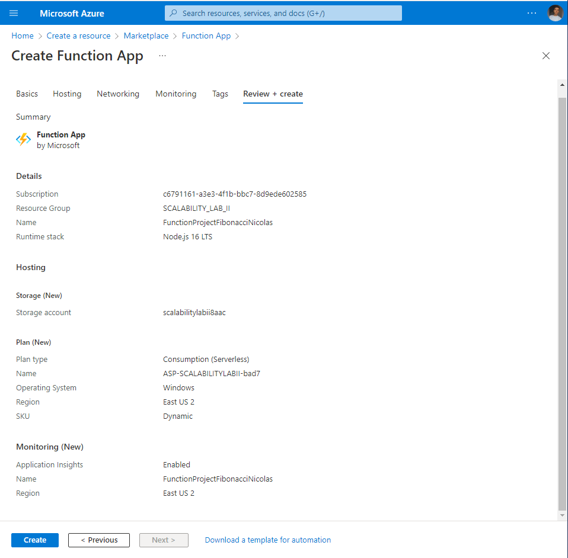
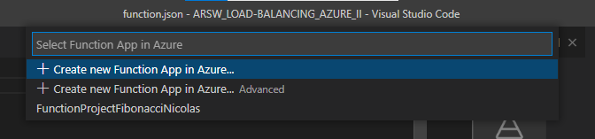
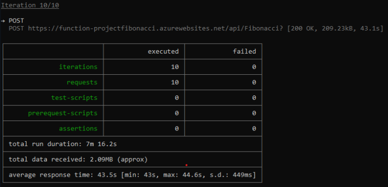
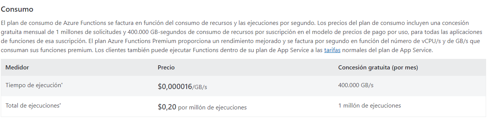
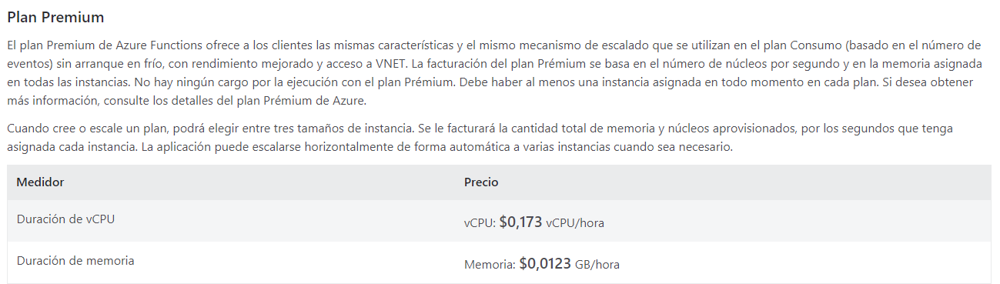
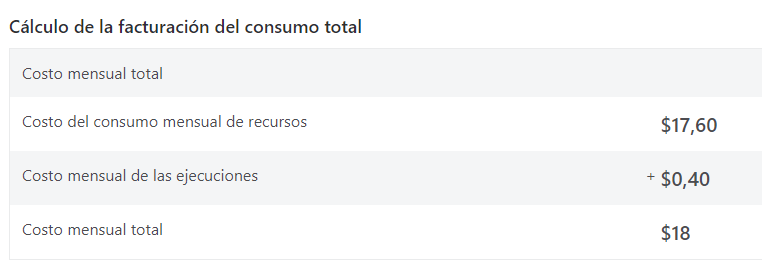

### Escuela Colombiana de Ingeniería
### Arquitecturas de Software - ARSW

## Escalamiento en Azure con Maquinas Virtuales, Sacale Sets y Service Plans

### Dependencias
* Cree una cuenta gratuita dentro de Azure. Para hacerlo puede guiarse de esta [documentación](https://azure.microsoft.com/es-es/free/students/). Al hacerlo usted contará con $100 USD para gastar durante 12 meses.
Antes de iniciar con el laboratorio, revise la siguiente documentación sobre las [Azure Functions](https://www.c-sharpcorner.com/article/an-overview-of-azure-functions/)

### Parte 0 - Entendiendo el escenario de calidad

Adjunto a este laboratorio usted podrá encontrar una aplicación totalmente desarrollada que tiene como objetivo calcular el enésimo valor de la secuencia de Fibonnaci.

**Escalabilidad**
Cuando un conjunto de usuarios consulta un enésimo número (superior a 1000000) de la secuencia de Fibonacci de forma concurrente y el sistema se encuentra bajo condiciones normales de operación, todas las peticiones deben ser respondidas y el consumo de CPU del sistema no puede superar el 70%.

### Escalabilidad Serverless (Functions)

1. Cree una Function App tal cual como se muestra en las  imagenes.

Creamos la Function App con las siguientes especificaciones

2. Instale la extensión de **Azure Functions** para Visual Studio Code.

3. Despliegue la Function de Fibonacci a Azure usando Visual Studio Code. La primera vez que lo haga se le va a pedir autenticarse, siga las instrucciones.

de esta forma nos sale nuestra funcion

4. Dirijase al portal de Azure y pruebe la function.

5. Modifique la coleción de POSTMAN con NEWMAN de tal forma que pueda enviar 10 peticiones concurrentes. Verifique los resultados y presente un informe.

6. Cree una nueva Function que resuleva el problema de Fibonacci pero esta vez utilice un enfoque recursivo con memoization. Pruebe la función varias veces, después no haga nada por al menos 5 minutos. Pruebe la función de nuevo con los valores anteriores. ¿Cuál es el comportamiento?.

**Preguntas**

* ¿Qué es un Azure Function?

    Azure Functions es un servicio en la nube disponible a petición que proporciona toda la infraestructura y los recursos, que se actualizan continuamente, necesarios para ejecutar las aplicaciones.

* ¿Qué es serverless?

    La computación sin servidor es un modelo de ejecución en el que el proveedor de servicios en la nube (AWS, Azure o Google Cloud) es responsable de ejecutar un fragmento de código mediante la asignación dinámica de los recursos. Y solo cobrar por la cantidad de recursos utilizados para ejecutar el código. El código normalmente se ejecuta dentro de contenedores sin estado que pueden ser activados por una variedad de eventos, incluyendo solicitudes http, eventos de bases de datos, servicios de cola, alertas de monitoreo, cargas de archivos, eventos programados (trabajos cron), etc.

* ¿Qué es el runtime y que implica seleccionarlo al momento de crear el Function App?

    Runtime o tiempo de ejecución es el intervalo de tiempo en el que un programa se ejecuta en un sistema operativo. Una aplicación de función se ejecuta en una versión específica del runtime de Azure Functions. Hay cuatro versiones principales: 4.x, 3.x, 2.x y 1.x. De forma predeterminada, las aplicaciones de función se crean en la versión 4.x del entorno de ejecución. Depensiendo de esta eleccion la funcion tiene ciertas funciones y planes de aplicación.

* ¿Por qué es necesario crear un Storage Account de la mano de un Function App?

    Es importante para la administración de desencadenadores y el registro de ejecuciones de funciones. 

* ¿Cuáles son los tipos de planes para un Function App?, ¿En qué se diferencias?, mencione ventajas y desventajas de cada uno de ellos.

    -Plan Consumption: Cuando se usa el plan de consumo, las instancias del host de Azure Functions se agregan y quitan de forma dinámica según el número de eventos entrantes. El plan de consumo es la opción de hospedaje completamente sin servidor de Azure Functions.
    
    * Ventajas: El plan de consumo se escala automáticamente, incluso durante períodos de carga alta. Cuando se ejecutan funciones en un plan de consumo, se le cobran los recursos de proceso solo cuando se ejecutan las funciones. En un plan de consumo, se agota el tiempo de espera de una ejecución de función tras un período de tiempo configurable.
    

    -Plan Dedicated: Define un conjunto de recursos de proceso para que una aplicación se ejecute. Estos recursos de proceso son análogos a la granja de servidores de un hospedaje convencional. Una o varias aplicaciones de funciones se pueden configurar para que se ejecuten en los mismos recursos informáticos (plan de App Service) que otras aplicaciones de App Service, como aplicaciones web.

    * Ventajas: Tiene máquinas virtuales infrautilizadas que ya ejecutan otras instancias de App Service.
    

    -Plan Premium:es una opción de hospedaje de escalado dinámico para las aplicaciones de funciones, escala automaticamente en función de la demandas

    * Ventajas:es una opción de hospedaje de escalado dinámico para las aplicaciones de funciones. Conectividad de red virtual.
    

* ¿Por qué la memoization falla o no funciona de forma correcta?

    Porque cuando termina la ejecucion al pasar un tiempo el plan no guarda la información por lo que la función se restablece perdiendo la memorización.

* ¿Cómo funciona el sistema de facturación de las Function App?

    
    

    Tambien se tiene una facturacion del consumo de recursos y de las ejecuciones 

    